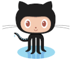

 Un sitio dedicado a documentar lo que voy aprendiendo sobre de desarrollo web:

Voy escribiendo y apuntando : [Ir al Blog](/posts/)

Algunos temas del blog  que he ido ordenando:


[Que es una terminal](posts/que-es-una-terminal/)




[Virtual Host](posts/crear-virtualhost/)




[Node y NPM](posts/npm/)




También tengo recursos en algunos sitios a los que se puede acceder:


 

