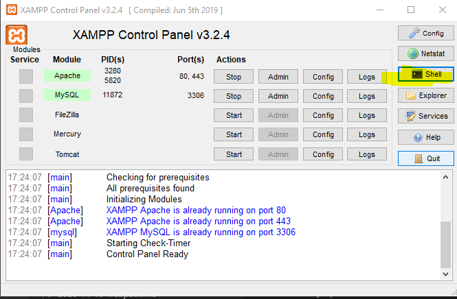

Abrimos el shell de xampp desde el panel de control de xampp


Nos situamos con el shell en el directorio mysql
````
cd mysql
````

Nos autenticamos
````
Jose@DESKTOP-BF0SC2G c:\xampp\mysql
# mysql -u root -p`
````
Nos pedirá el password y tras ponerlo (por defecto no lleva)nos dirigirá al prompt de mysql o mariadb en este caso

````mysql
Enter password:
Welcome to the MariaDB monitor.  Commands end with ; or \g.
Your MariaDB connection id is 9
Server version: 10.4.16-MariaDB mariadb.org binary distribution

Copyright (c) 2000, 2018, Oracle, MariaDB Corporation Ab and others.

Type 'help;' or '\h' for help. Type '\c' to clear the current input statement.

MariaDB [(none)]>
````


Y ya estamos dentro y podemos crear, acceder y consultar una base de datos 
````
CREATE DATABASE laravel
````